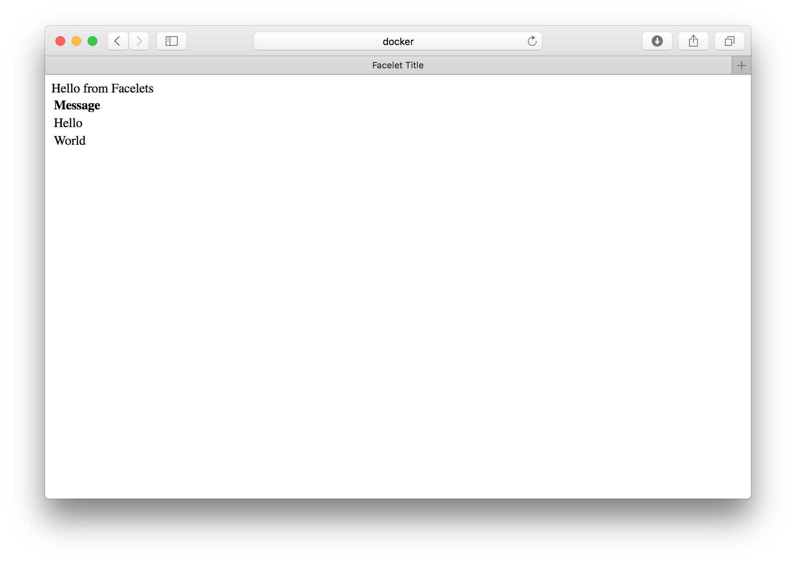

# dockerstart
getting on the same level with docker.

* EricSoldierer added the hello world docker composer app, consisting of a persistence part and a web part.
* jantrienes and holgerkemper added instructions and configuration of how to deploy the application with Maven to Wildfly.

homberghp: Please build war yourselves. It does not belong in a repository anyway, and you will have a go with maven.

# Start Docker Machine
This section describes how you can start your docker machine on different operating systems.

## Linux

## Windows

## macOS
Start your docker machine and establish a connection to it:
``` bash
docker-machine start
eval $(docker-machine env)
```

# Docker Compose to Link Containers
This `helloworld` application consists of two containers. One representing the database, and the other the application server. To start up both of them, execute the following command in the folder where the `docker-compose.yml` file is located.

```bash
docker-compose up -d
```

Now, you should be able to connect to the Wildfy server via `http://192.168.99.100:8011` in your browser.

*Hint: The IP address as well as how you establish a connection to the docker-machine depends on how you installed and/or configured docker on your machine. On some machines the docker machine can be accessed under `http://localhost:port`.*

# Wildfly and Maven
When you develop an application that is supposed to run on a server, you will somehow have to deploy it. While manual deployment is possible, it is very time consuming. Luckily, Maven can assist us with this process.

There is a [Maven plugin](https://docs.jboss.org/wildfly/plugins/maven/latest/) to deploy applications onto a Wildfly container. For other application containers, similar Maven plugins exist.

Following is a brief description of how to setup this plugin, and how to deploy the application to Wildfly.

## Plugin Configuration
Since the configuration parameter like the ip address, the username and/or the password usually differ from user to user, these parameters should be configured per user. This can be done in the global maven configuration. On Unix, this file is located under `~/.m2/settings.xml`. On Windows it can be found at `%USER_PROFILE%\.m2\settings.xml`.

Add the following configuration to this file:
```xml
<profiles>
  <profile>
    <id>wildfly-remote</id>
    <properties>
      <wildfly-hostname>192.168.99.100</wildfly-hostname>
      <wildfly-port>9990</wildfly-port>
      <wildfly-username>admin</wildfly-username>
      <wildfly-password>Admin#70365</wildfly-password>
    </properties>
  </profile>
</profiles>
```

## Deploy Application
After that, you can deploy the helloworld web app to your Wildfly server. Execute the following command in your maven project.

``` bash
mvn clean install wildfly:deploy -P wildfly-remote
```

Verify the result in your browser: `http://192.168.99.100:8011/helloworld-1.0-SNAPSHOT/`. The result should be something like this:



# Docker and NetBeans IDE

After the demo by *MarvinRuesenberg* on how to connect the netbeans docker client, homberghp inverstigated a little further. The following was necessary to get it working on an Ubuntu installation:

In the file `/lib/systemd/system/docker.service` add the line

`EnvironmentFile=-/etc/default/docker`

before

`ExecStart=/usr/bin/dockerd -H fd://`

and change that last line to

`ExecStart=/usr/bin/dockerd $DOCKER_OPTS -H fd://`

(add $DOCKER_OPTS).

Then in the file

`/etc/default/docker`

add or change the line

`DOCKER_OPTS="-H tcp://127.0.0.1:2375"`


lastly, in your `~/.bashrc`, add

`export DOCKER_HOST=tcp://127.0.0.1:2375`

This allows to connect and command docker from both services, one being the setup netbeans service, the other one being the commandline interface. By default this is not possible since docker is communicating via an Unix Socket which netbeans cannot connect to.

By doing the above, we are opening an actual network tcp-socket that netbeans is able to address.

Enjoy.
